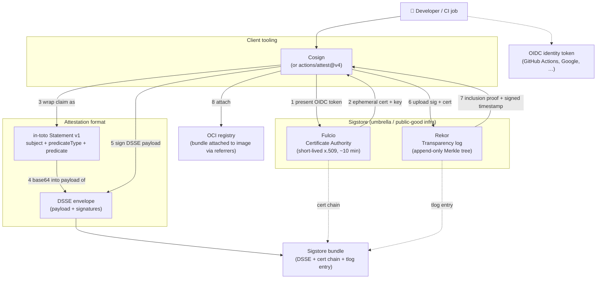

# Notes — Inspecting attestation bundles

Reference notes on how to peek inside the signed attestation bundles that
`gh attestation download` writes for images built by this demo. Companion
material to `README.md` and `verify.sh`.

---

## Q: Explain this command

```bash
jq -r '.dsseEnvelope.payload | @base64d | fromjson | .predicateType' sha256:*.jsonl
```

This one line does four unwrapping steps to peek inside a signed attestation
without verifying it.

### The tools

- **`jq`** — a command-line JSON processor. `-r` means "raw output": print
  string results without JSON quoting, so you get
  `https://slsa.dev/provenance/v1` and not `"https://slsa.dev/provenance/v1"`.
- **The `|` pipes inside the single quotes** — these are **`jq` pipes**, not
  shell pipes. Inside a `jq` filter, `A | B` means "compute A, then feed its
  output as input to B." Same idea as shell piping but happens entirely
  inside `jq`.

### The file(s)

- **`sha256:*.jsonl`** — shell glob that expands to whatever file(s)
  `gh attestation download` wrote (e.g. `sha256:92c04c0…f6ac.jsonl`).
  Using the glob means you don't have to paste the digest.
- **`.jsonl`** — "JSON Lines": one JSON object per line, no wrapping array.
  `jq` reads it a line at a time and applies the filter to each. That's why
  running this on your file printed *two* lines — one per attestation on
  the image.

### The nesting: what an attestation actually looks like

Each line in the file is a **Sigstore bundle**. The interesting bit is buried
inside layers of wrapping. Here's the shape, and what the `jq` filter peels
off at each step:

```
Sigstore bundle (top-level object on each line)
└── .dsseEnvelope                       ← DSSE = signature envelope
    ├── .signatures[…]                   (not what we're after)
    ├── .payloadType = "application/vnd.in-toto+json"
    └── .payload  ← base64-encoded blob  ← [step 1] jq grabs this string
                                             │
                    base64-decoded  ←── [step 2] @base64d
                                             ▼
                    in-toto statement (JSON text)
                    ├── ._type = "https://in-toto.io/Statement/v1"
                    ├── .subject[…] = [{name, digest: {sha256:…}}]
                    ├── .predicateType  ← [step 4] jq extracts THIS
                    └── .predicate = {…}
                                             ▲
                    parse text to JSON ── [step 3] fromjson
```

**Why the double-wrap?** DSSE (Dead Simple Signing Envelope) is a signing
format that wraps *any* payload plus signatures. Signatures always cover the
*base64-encoded* string of the payload, not the raw JSON — otherwise a
signature over `{"a":1}` and over `{ "a": 1 }` would be different for the
same logical content. Base64 pins down exact bytes, sidestepping the JSON
whitespace-canonicalization problem.

### The filter, one segment at a time

```
'.dsseEnvelope.payload | @base64d | fromjson | .predicateType'
```

1. **`.dsseEnvelope.payload`** — starting from the top-level bundle, dive to
   `dsseEnvelope`, then to its `payload` field. The result is a base64 string
   like `eyJfdHlwZSI6…`.
2. **`| @base64d`** — `@base64d` is `jq`'s base64-decode formatter (the
   `d` = decode; `@base64` on its own encodes). Output is now the *text* of
   the in-toto statement — still a JSON-shaped string, but from `jq`'s point
   of view it's just a string.
3. **`| fromjson`** — parse that string as JSON so `jq` treats it as a
   structured object again. Without this, the next step would fail because
   you can't `.field` into a string.
4. **`| .predicateType`** — pick the `predicateType` field. That's the URI
   that identifies what *kind* of claim the attestation makes:
   - `https://slsa.dev/provenance/v1` → SLSA build provenance
   - `https://spdx.dev/Document/v2.3` → SPDX SBOM
   - Others exist for VSA, VEX, custom predicates, etc.

### Why this specific command is useful

`gh attestation verify` filters by predicate type per invocation and hides
everything else, so it's easy to think an attestation is missing when it
isn't. This command bypasses verification entirely and just asks *"what
predicate types are attached to this image?"* — the definitive way to answer
*are both my attestations really there?* (exactly how we diagnosed the
one-vs-two-attestations confusion earlier).

### Handy variants

- **See more than just the type — dump the whole statement per attestation:**

  ```bash
  jq '.dsseEnvelope.payload | @base64d | fromjson' sha256:*.jsonl
  ```

- **Only the SPDX one, fully unwrapped (the SBOM itself):**

  ```bash
  jq 'select((.dsseEnvelope.payload | @base64d | fromjson | .predicateType)
             | startswith("https://spdx.dev/"))
      | .dsseEnvelope.payload | @base64d | fromjson | .predicate' \
     sha256:*.jsonl
  ```

- **Just the subject digest each attestation is bound to** (useful to
  confirm they all target the same image):

  ```bash
  jq -r '.dsseEnvelope.payload | @base64d | fromjson
         | .subject[0].digest.sha256' sha256:*.jsonl
  ```

---

## Q: So this file is actually 2 certificates?

Close, but the vocabulary matters here — "attestation," "bundle," and
"certificate" are three related-but-distinct things.

### What the file actually contains

The `.jsonl` file has **two lines**. Each line is one **Sigstore bundle** —
a JSON object that carries everything a verifier needs to trust the claim on
that line. So the file has:

- **2 lines**
- **2 bundles**
- **2 attestations** (one per bundle)
- **2 signing certificates** (one embedded per bundle)
- **2 signatures** (one embedded per bundle)
- **2 Rekor transparency-log entries** (one referenced per bundle)

Everything in that list is "2" because everything comes packaged inside its
own bundle. So yes — in the loose sense that the file contains two
certificates, that's true. But it's more accurate to say the file contains
**two attestation bundles**, each of which happens to include a certificate.

### What's inside one bundle

Think of each line as an envelope with four separately-useful pieces:

```
Sigstore bundle  (one line of the .jsonl)
├── verificationMaterial
│   ├── x509CertificateChain
│   │   └── certificates[]           ← the code-signing cert (Fulcio-issued)
│   └── tlogEntries[]                ← proof it was logged to Rekor
│
└── dsseEnvelope
    ├── payload                       ← base64(in-toto statement)  ← the attestation
    ├── payloadType                   ← "application/vnd.in-toto+json"
    └── signatures[]                  ← signature over the payload
```

- The **attestation** proper is the payload inside `dsseEnvelope` — the
  in-toto statement declaring "image `sha256:92c0…` has predicate X." That's
  the actual factual claim.
- The **certificate** is the ephemeral (~10-minute lifetime) x.509 cert
  Fulcio issued when GitHub's OIDC token was presented. Its Subject
  Alternative Name encodes exactly which workflow, at which repo, at which
  ref, produced this attestation. It's what `gh attestation verify` looks at
  when it enforces `--repo` and `--signer-workflow`.
- The **signature** is over the payload, produced by the private key that
  was pair-generated with the certificate. `gh` verifies: (a) the signature
  is valid against the cert's public key, and (b) the cert chains up to
  Sigstore's public-good Fulcio root.
- The **Rekor entry** is a signed receipt from Sigstore's transparency log
  proving that this signature-and-cert pair were logged publicly at time T.
  That's how the ephemeral cert stays trustworthy after it expires: even if
  the cert is now dead, the tlog entry says "when that cert was alive at
  time T, it signed this."

### Why the two bundles in this file

Both bundles bind the **same subject** (the image `sha256:92c0…`) but carry
**different predicates**:

- Line 1: `predicateType = "https://slsa.dev/provenance/v1"` — the SLSA
  build-provenance predicate produced by `actions/attest@v4` in default mode.
- Line 2: `predicateType = "https://spdx.dev/Document/v2.3"` — the SPDX SBOM
  produced by Syft and signed by `actions/attest@v4` in SBOM mode.

They were signed in **two separate signing operations** by two separate
steps in the workflow. That's why each has its own certificate — Fulcio
issues a fresh short-lived cert per OIDC-token-backed signing request, so a
workflow that signs twice ends up with two certs. Same *identity* (the SAN
"this workflow at this ref"), different *keys and certs*.

### A quick sanity check you can run

```bash
# How many bundles (i.e. lines)?
wc -l sha256:*.jsonl                              # → 2

# What are the two certificate SANs? Should be identical — same workflow.
jq -r '.verificationMaterial.x509CertificateChain.certificates[0].rawBytes' sha256:*.jsonl \
  | while read -r cert; do
      echo "$cert" | base64 -d \
        | openssl x509 -inform DER -noout -ext subjectAltName
    done

# What are the two predicate types? Should differ — provenance vs SBOM.
jq -r '.dsseEnvelope.payload | @base64d | fromjson | .predicateType' sha256:*.jsonl
```

That last one is the command explained above. The first two make the
"two-certs-same-identity" story concrete.

### Short answer

The file has **two attestations**, each wrapped in its own Sigstore bundle,
and each bundle carries its own ephemeral signing certificate. So there are
two certificates in the file — but the certificates aren't the star of the
show. The **attestations** are; the certs are one piece of the machinery
that makes each attestation independently verifiable.

---

## Q: Explain the differences and relationship between in-toto, Sigstore, Rekor, and cosign

These four names get thrown around together, and it's not obvious from the
outside which is a *format*, which is a *service*, and which is a *tool*.
Here's the layering, then each one on its own, then how they show up
concretely in this demo.

### The four things at a glance

| Name | Kind | One-line role |
|---|---|---|
| **in-toto** | Specification (format) | Defines the *shape* of a supply-chain claim: subject + predicate + signatures |
| **Sigstore** | Umbrella project (ecosystem of services) | Free, public infrastructure for signing software without long-lived keys |
| **Rekor** | One Sigstore component (service) | An append-only public transparency log that receives signing events |
| **Cosign** | A client-side tool (CLI) | Signs and verifies things using Sigstore; can also produce/attach in-toto attestations |

They're not competitors. They stack:

```
YOU (a developer or CI job)
   │
   ▼
Cosign / actions/attest@v4        ← client tool: does the work
   │
   ├─► Fulcio (Sigstore CA)       ← "here's my OIDC token, issue me a
   │                                  short-lived x.509 cert"
   │
   ├─► signs an in-toto statement ← format: what claim am I making?
   │                                        (subject, predicate)
   │
   └─► Rekor (Sigstore tlog)      ← "log the signature+cert publicly so
                                     anyone can prove this happened"
```

The same relationships, rendered — note that **Fulcio and Rekor sit inside
Sigstore**, while **in-toto is a separate format** that Cosign happens to
sign:



Read it as three layers plus one flow:

- **Client tooling** (Cosign / `actions/attest@v4`) is what a human or CI
  job actually invokes.
- **Attestation format** (in-toto statement wrapped in a DSSE envelope) is
  independent of Sigstore — you could sign the same in-toto statement with
  a plain long-lived key and no transparency log, and it would still be a
  valid attestation. Sigstore just makes it *keyless and durable*.
- **Sigstore** contributes the two services (Fulcio + Rekor) that let step
  1–2 (get a short-lived cert) and step 6–7 (log it forever) happen.
- The final **Sigstore bundle** is the single JSON object that packages
  the signed DSSE, the Fulcio cert, and the Rekor tlog entry so any
  verifier can check everything offline given only Sigstore's public roots.

### in-toto — the *format*, not a program

in-toto is a specification maintained by the [in-toto project][in-toto] (a
CNCF project, born out of NYU research). It has no server, no daemon, no
required CLI. It's a set of JSON schemas.

The one you already saw is the **in-toto Statement v1**:

```json
{
  "_type": "https://in-toto.io/Statement/v1",
  "subject":       [ { "name": "…", "digest": { "sha256": "…" } } ],
  "predicateType": "https://slsa.dev/provenance/v1",
  "predicate":     { …type-specific fields… }
}
```

- The **subject** identifies *what* the claim is about (usually by digest, so
  it's immutable).
- The **predicate** is the claim itself. Different predicate types describe
  different things:
  - `https://slsa.dev/provenance/v1` — SLSA build provenance
  - `https://spdx.dev/Document/v2.3` — an SBOM
  - `https://in-toto.io/attestation/vulns/v0.2` — a vuln scan result
  - `https://slsa.dev/verification_summary/v1` — a VSA
  - Custom predicate URIs — anything you want

in-toto only defines the container. It doesn't say *who* signs it, or *how*,
or *where* the signature is stored. Those are separate problems, solved by
DSSE (the envelope format around the statement), Sigstore (a keyless signing
service), and cosign or a registry (storage).

**Analogy:** in-toto is to attestations what JWT is to auth tokens — a
container format. JWT doesn't care who your identity provider is; in-toto
doesn't care who signs the statement.

### Sigstore — the *ecosystem* for keyless signing

Sigstore is an umbrella project (Linux Foundation, now graduated OpenSSF)
that provides free public services letting anyone sign software **without
managing long-lived keys**. The traditional pain of code signing was: get a
key from a CA for money, guard it forever, revoke it if compromised.
Sigstore's insight is *ephemeral keys plus a public transparency log*:

1. You prove your identity to a **certificate authority** using an OIDC token
   (from GitHub, Google, etc.).
2. The CA issues an **x.509 certificate valid for ~10 minutes**, with your
   identity encoded in the SAN (Subject Alternative Name).
3. You use the associated private key to sign your artifact, then **throw
   the key away**.
4. To keep the ephemeral signature trustworthy forever, both the signature
   and the certificate are recorded in a **public append-only log** at
   time T. Anyone in the future can prove: *"at time T, an identity of
   `<x>` signed `<hash>` — and that transparency log is tamper-evident, so
   this record is real."*

The **components** of Sigstore that you need to know:

| Component | Role |
|---|---|
| **Fulcio** | The certificate authority. Accepts OIDC tokens, issues short-lived x.509 certs. |
| **Rekor** | The transparency log. Appends signature+cert entries; provides Merkle proofs. |
| **Cosign** | The reference client CLI. Interacts with Fulcio and Rekor. |
| **Public-good instance** | Free hosted Fulcio + Rekor at `sigstore.dev`, funded by Linux Foundation members. What this demo uses. |
| **Private Sigstore** | You can also run Fulcio + Rekor yourself for internal-only signing. GitHub does this for private-repo attestations. |

Sigstore is *ecosystem*, not a single deliverable. When someone says "signed
with Sigstore," they mean this whole ephemeral-key + Fulcio + Rekor pattern.

### Rekor — the *transparency log* piece of Sigstore

Rekor deserves its own callout because it's the mechanism that makes
Sigstore's whole "throw the key away" story work.

- It is a **Trillian-backed Merkle-tree log**, same design pattern as
  Certificate Transparency logs (CT) for TLS certs.
- Each entry is an immutable record of `(signature, certificate, hash of
  signed content)`. Once added, the entry can't be removed or altered
  without detection.
- Every entry gets an **inclusion proof** — a Merkle path from the entry up
  to the current signed tree head. Verifiers use it to prove *"this entry
  really is in the log at position N."*
- Rekor also signs each tree head, so its own log integrity is verifiable
  offline given the current signed tree head.

**Why it matters:** without Rekor, an ephemeral cert would be useless after
~10 minutes — nothing would prove that the signature happened while the cert
was still valid. With Rekor, the log entry is dated (signed timestamp), and
that record itself is what verifiers trust: *"the cert existed and this
signature was made at time T, per the log."* The cert can then expire
without weakening the signature.

You can browse the public-good Rekor at <https://search.sigstore.dev/>.

### Cosign — the *client tool*

Cosign is a CLI produced by the Sigstore project. It's the reference client
that wires everything together. You'd invoke it directly if you were
signing/verifying by hand outside of CI:

```bash
# Sign a container image, keylessly, via GitHub OIDC + Fulcio + Rekor
cosign sign ghcr.io/user/app@sha256:…

# Sign an attestation (in-toto statement) against a container image
cosign attest --predicate provenance.json \
              --type slsaprovenance \
              ghcr.io/user/app@sha256:…

# Verify a signed image against a repo + workflow identity
cosign verify ghcr.io/user/app@sha256:… \
              --certificate-identity-regexp "…" \
              --certificate-oidc-issuer https://token.actions.githubusercontent.com

# Verify an attached attestation
cosign verify-attestation ghcr.io/user/app@sha256:… \
              --type slsaprovenance …
```

Cosign talks to Fulcio (get cert), does the signing locally, uploads to
Rekor, and — for containers — attaches the resulting Sigstore bundle to the
image manifest in the OCI registry using a
[reference-type manifest][ref-type]. That's how the bundle ends up "next
to" the image without changing the image's digest.

**Relationship to `actions/attest@v4`:** attest doesn't shell out to the
`cosign` binary, but it uses the same Sigstore machinery — same Fulcio,
same Rekor, same OCI attachment mechanism, same bundle format. It's a
Node.js GitHub Action wrapper (`@actions/attest` npm package) that speaks
the Sigstore protocols directly. If you built the same workflow with a
`cosign sign-blob` step and an OCI attach, you'd get an equivalent
artifact. attest is just tighter integration for the GitHub-Actions case.

**Relationship to `gh attestation verify`:** the GitHub CLI has its own
verification code (Go, not a wrapper around cosign) — but it does the same
work: fetch the bundle, verify the DSSE signature against the Fulcio cert,
check the cert chain and the Rekor inclusion proof, check that the SAN in
the cert matches `--repo` / `--signer-workflow`. Same math, different UI.

### How these four show up concretely in this demo

Every one of your `sha256:…jsonl` files is where the four names come
together. Trace one bundle top-to-bottom:

```
Sigstore bundle (JSON on one line)
│
├── dsseEnvelope
│   ├── payload = base64( … in-toto statement … )   ◄── in-toto: the FORMAT
│   │   {
│   │     "_type":         "https://in-toto.io/Statement/v1",
│   │     "subject":       [{ "name": "…", "digest": {"sha256":"…"} }],
│   │     "predicateType": "https://slsa.dev/provenance/v1",
│   │     "predicate":     { … }
│   │   }
│   └── signatures  ◄── ECDSA signature made with the ephemeral key
│                        that was pair-generated with the Fulcio cert
│
├── verificationMaterial
│   ├── x509CertificateChain                        ◄── Sigstore Fulcio: the CA
│   │      A short-lived cert bound to
│   │      "workflow foo.yml in falconcrwd/slsademo
│   │       at ref refs/heads/main" (encoded in the SAN)
│   │
│   └── tlogEntries                                 ◄── Sigstore Rekor: the LOG
│          {
│            "logIndex":    12345678,
│            "integratedTime": 172…,
│            "inclusionProof": { … Merkle path … },
│            "canonicalizedBody": "…"
│          }
│
```

- **in-toto** is the shape of the payload — a Statement v1 with subject +
  predicate. It's the *what* being attested.
- **Sigstore** is the umbrella. Everything about the cert and the log entry
  is Sigstore infrastructure.
- **Fulcio** issued the cert in the `verificationMaterial`. (Fulcio wasn't
  in the question, but it's the missing fourth piece — without it there'd
  be nothing to sign with.)
- **Rekor** is the log that received the `logIndex: 12345678` entry. That
  entry is what makes the ephemeral cert's signature verifiable forever.
- **Cosign** wasn't invoked in this workflow (`actions/attest@v4` was),
  but it can consume this bundle interchangeably —
  `cosign verify-attestation ghcr.io/…` reads the same Sigstore bundle
  format that `actions/attest@v4` produces.

### The one-sentence version of each

- **in-toto** is the *language* you use to say something about an artifact.
- **Sigstore** is the *free public infrastructure* you use to sign things
  without keeping keys around.
- **Rekor** is *the specific transparency log inside Sigstore* that makes
  ephemeral-key signatures durable.
- **Cosign** is *the CLI* that stitches them together for humans;
  libraries like `actions/attest` do the same for CI pipelines.

[in-toto]: https://in-toto.io/
[ref-type]: https://github.com/opencontainers/distribution-spec/blob/main/spec.md#referrers
